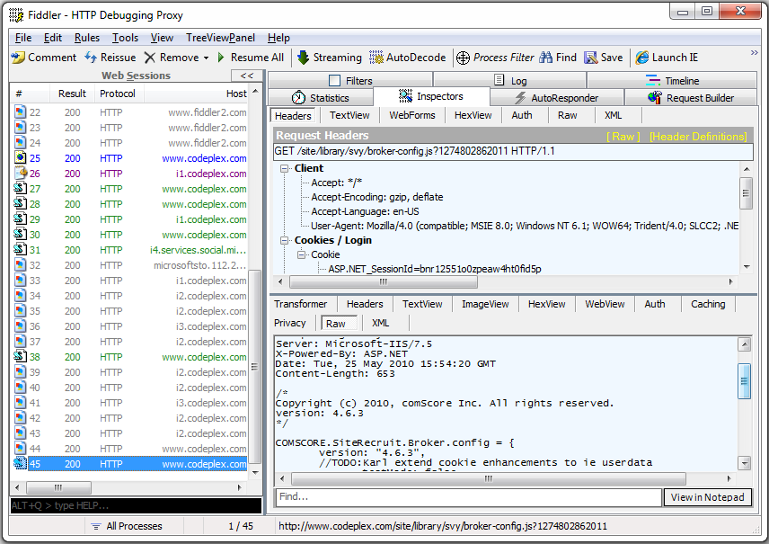

# Fiddler Treeview Panel Extension

Extension for Fiddler, to display the session information in a TreeView panel instead of the default ListBox, so it groups the information logically...

If you need to capture http traffic there are several tools out there that can help you with this task, and a really good one is [Fiddler](http://www.fiddler2.com).
It's really flexible and, best of all, it's free. :-)

The only thing you might be a little bit annoyed with is that, when analyzing a site that performs lots of calls, you might end up with a screen like the following:

which is a great amount of information but it's a bit complicated to locate exactly the session you're looking for (sure, you can sort the ListView and such, but that wasn't _fast enough_ for me. :-D).

So, to address this issue I have created an extension that displays all the sessions in a TreeView, so the hosts, folders and calls are organized in a tree structure, much faster to locate what you want and to collapse entire sections of data you don't need. The results for the same captured data can be seen in the next screenshot:

Please read the migrated docs for more information until I have time to arrange the README.md file. :-)

You can download the compiled binaries here in the meantime:

[http://blog.gamosoft.com/fiddler-treeview-panel-extension/](http://blog.gamosoft.com/fiddler-treeview-panel-extension/)
